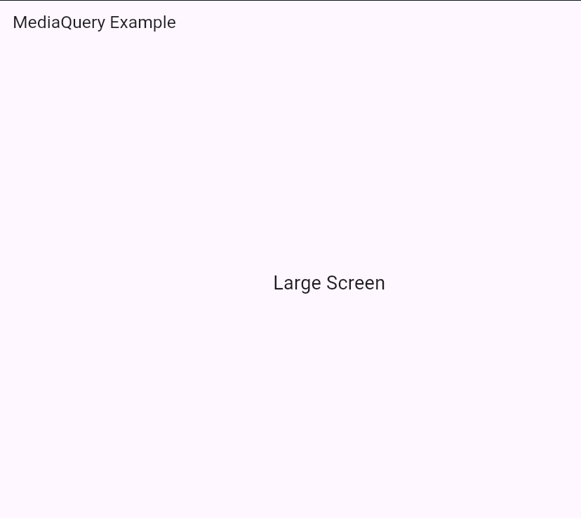

# Responsive Layout in Flutter

This README provides simple examples of two different methods used to build responsive UIs in Flutter.

## Program Output




## A) Using MediaQuery

MediaQuery allows you to get the device's screen size and apply conditions to change UI based on width, height, or orientation.

### **Code Explanation**

* `MediaQuery.of(context).size.width` gives the screen width.
* If width > 600 → treat it as a large screen.
* Otherwise → small screen.

### **Example Code**

```dart
import 'package:flutter/material.dart';

void main() {
  runApp(MyApp());
}

class MyApp extends StatelessWidget {
  @override
  Widget build(BuildContext context) {
    return MaterialApp(
      home: MediaQueryExample(),
    );
  }
}

class MediaQueryExample extends StatelessWidget {
  @override
  Widget build(BuildContext context) {
    double screenWidth = MediaQuery.of(context).size.width;

    return Scaffold(
      appBar: AppBar(title: Text("MediaQuery Example")),
      body: Center(
        child: Text(
          screenWidth > 600 ? "Large Screen" : "Small Screen",
          style: TextStyle(fontSize: 24),
        ),
      ),
    );
  }
}
```

---

## B) Using LayoutBuilder

LayoutBuilder gives constraints of the parent widget and adapts UI based on those constraints.

### **Code Explanation**

* `constraints.maxWidth` provides the width available to the widget.
* If width > 400 → show big-screen UI.
* Otherwise → show small-screen UI.

### **Example Code**

```dart
import 'package:flutter/material.dart';

void main() {
  runApp(const MyApp());
}

class MyApp extends StatelessWidget {
  const MyApp({super.key});

  @override
  Widget build(BuildContext context) {
    return MaterialApp(
      home: Scaffold(
        appBar: AppBar(title: const Text("LayoutBuilder Example")),
        body: LayoutBuilder(
          builder: (context, constraints) {
            if (constraints.maxWidth > 400) {
              return Container(
                color: Colors.blue,
                child: const Center(
                  child: Text(
                    "Big Screen",
                    style: TextStyle(fontSize: 30, color: Colors.white),
                  ),
                ),
              );
            }

            return Container(
              color: Colors.green,
              child: const Center(
                child: Text(
                  "Small Screen",
                  style: TextStyle(fontSize: 25, color: Colors.white),
                ),
              ),
            );
          },
        ),
      ),
    );
  }
}
```

---

## Summary

| Method            | Best For                  | What It Uses                    |
| ----------------- | ------------------------- | ------------------------------- |
| **MediaQuery**    | Screen dimensions         | Device width/height/orientation |
| **LayoutBuilder** | Parent widget constraints | Max width / max height          |

Both are useful for building responsive UI based on available space.

