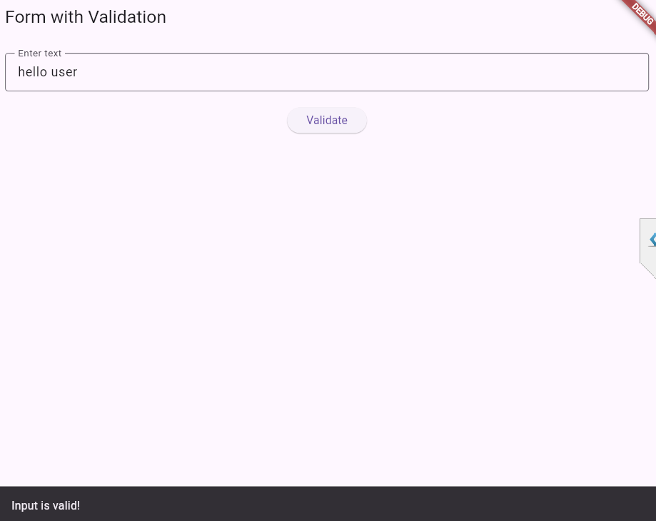

---

# Flutter Forms – Simple Examples

This project contains two basic Flutter programs demonstrating **forms**, **text input**, and **validation**.
Perfect for beginners practicing in **VS Code**.

---

## Program Output




---

## 📘 **A) Simple Form**

This example shows how to create a **basic form** with a single text input field and display the entered text.

### **Features**

* One `TextField`
* Uses `TextEditingController`
* Displays typed text
* Beginner-friendly

### **Code**

```dart
import 'package:flutter/material.dart';

void main() {
  runApp(MyApp());
}

class MyApp extends StatelessWidget {
  @override
  Widget build(BuildContext context) {
    return MaterialApp(
      home: SimpleForm(),
    );
  }
}

class SimpleForm extends StatefulWidget {
  @override
  _SimpleFormState createState() => _SimpleFormState();
}

class _SimpleFormState extends State<SimpleForm> {
  TextEditingController controller = TextEditingController();
  String output = "";

  @override
  Widget build(BuildContext context) {
    return Scaffold(
      appBar: AppBar(title: Text("Simple Form")),
      body: Padding(
        padding: const EdgeInsets.all(16),
        child: Column(
          children: [
            TextField(
              controller: controller,
              decoration: InputDecoration(
                labelText: "Enter text",
                border: OutlineInputBorder(),
              ),
            ),
            SizedBox(height: 20),
            ElevatedButton(
              onPressed: () {
                setState(() {
                  output = controller.text;
                });
              },
              child: Text("Submit"),
            ),
            SizedBox(height: 20),
            Text(
              "You typed: $output",
              style: TextStyle(fontSize: 18),
            ),
          ],
        ),
      ),
    );
  }
}
```

---

## 📗 **B) Form with Validation**

This example uses a **Form** and `TextFormField` with validation.
It displays a success message when the input is valid.

### **Features**

* Uses `Form` + `TextFormField`
* Basic validation (`input must not be empty`)
* Shows a Snackbar on valid input
* Useful for creating real forms

### **Code**

```dart
import 'package:flutter/material.dart';

void main() {
  runApp(MyApp());
}

class MyApp extends StatelessWidget {
  @override
  Widget build(BuildContext context) {
    return MaterialApp(
      home: FormWithValidation(),
    );
  }
}

class FormWithValidation extends StatefulWidget {
  @override
  _FormWithValidationState createState() => _FormWithValidationState();
}

class _FormWithValidationState extends State<FormWithValidation> {
  final _formKey = GlobalKey<FormState>();
  TextEditingController controller = TextEditingController();

  @override
  Widget build(BuildContext context) {
    return Scaffold(
      appBar: AppBar(title: Text("Form with Validation")),
      body: Padding(
        padding: const EdgeInsets.all(16),
        child: Form(
          key: _formKey,
          child: Column(
            children: [
              TextFormField(
                controller: controller,
                decoration: InputDecoration(
                  labelText: "Enter text",
                  border: OutlineInputBorder(),
                ),
                validator: (value) {
                  if (value == null || value.isEmpty) {
                    return "Please enter something";
                  }
                  return null;
                },
              ),
              SizedBox(height: 20),
              ElevatedButton(
                onPressed: () {
                  if (_formKey.currentState!.validate()) {
                    ScaffoldMessenger.of(context).showSnackBar(
                      SnackBar(content: Text("Input is valid!")),
                    );
                  }
                },
                child: Text("Validate"),
              ),
            ],
          ),
        ),
      ),
    );
  }
}
```

---

## ▶️ **How to Run in VS Code**

1. Install Flutter & Dart
2. Create a new Flutter project
3. Replace code inside `lib/main.dart`
4. Run using:

   ```
   flutter run
   ```

---