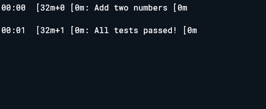

---

# Dart Simple Function + Unit Test

This project demonstrates a **simple Dart function** that adds two numbers and a **unit test** to verify its correctness. This version works in **DartPad** or a single-file Dart project.

---

## Program Output




---

## ✅ a) Simple Function

A function that takes two integers and returns their sum.

### **Code**

```dart
int add(int a, int b) {
  return a + b;
}
```

### **What You Learn**

* How to create a **function** in Dart
* How to pass **parameters** and return a value

---

## ✅ b) Unit Test

A test to verify that the `add()` function works correctly.

### **Code**

```dart
import 'package:test/test.dart';

void main() {
  test('Add two numbers', () {
    expect(add(5, 7), 12);
  });
}
```

### **What You Learn**

* How to write a **unit test** in Dart
* How to use `test()` and `expect()` functions
* How to validate function output automatically

---

## ▶️ How to Run

### **Option 1: DartPad**

1. Go to [https://dartpad.dev](https://dartpad.dev)
2. Paste the entire code (function + test)
3. Run it

### **Option 2: Local Dart Project**

1. Create a new Dart file `main.dart` and paste the code
2. Add `test` dependency in `pubspec.yaml`:

```yaml
dev_dependencies:
  test: ^1.24.0
```

3. Run in terminal:

```
dart pub get
dart run test main.dart
```

---