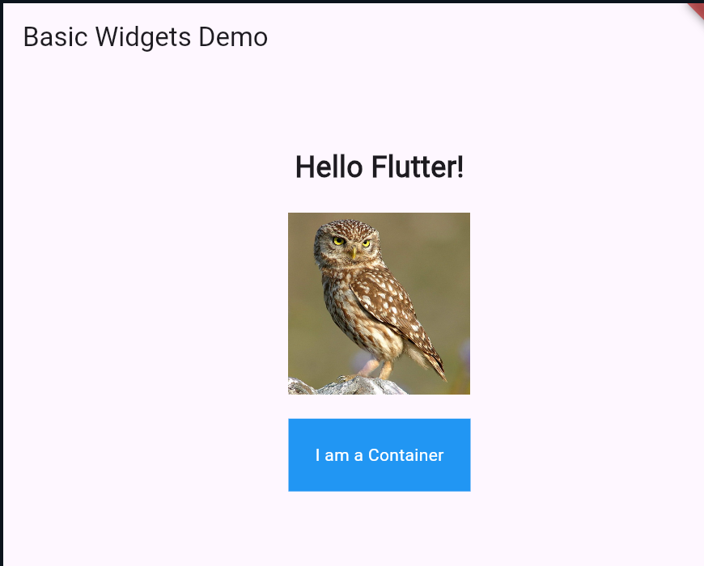

# Flutter Basics – Widgets and Layouts

## **A) Basic Widgets**

This program demonstrates three commonly used Flutter widgets: **Text**, **Image**, and **Container**.


## Program Output




### **Code Example**

```dart
import 'package:flutter/material.dart';

void main() {
  runApp(MyApp());
}

class MyApp extends StatelessWidget {
  @override
  Widget build(BuildContext context) {
    return MaterialApp(
      home: Scaffold(
        appBar: AppBar(
          title: Text("Basic Widgets Demo"),
        ),
        body: Center(
          child: Column(
            mainAxisAlignment: MainAxisAlignment.center,
            children: [
              // Text Widget
              Text(
                "Hello Flutter!",
                style: TextStyle(fontSize: 24, fontWeight: FontWeight.bold),
              ),

              SizedBox(height: 20),

              // Image Widget
              Image.network(
                "https://flutter.github.io/assets-for-api-docs/assets/widgets/owl.jpg",
                width: 150,
              ),

              SizedBox(height: 20),

              // Container Widget
              Container(
                width: 150,
                height: 60,
                color: Colors.blue,
                alignment: Alignment.center,
                child: Text(
                  "I am a Container",
                  style: TextStyle(color: Colors.white),
                ),
              ),
            ],
          ),
        ),
      ),
    );
  }
}
```

---

## **B) Layouts (Row, Column, Stack)**

This program demonstrates the three major Flutter layout widgets: **Row**, **Column**, and **Stack**.
A `SingleChildScrollView` is used to prevent overflow.

### **Code Example**

```dart
import 'package:flutter/material.dart';

void main() {
  runApp(MyLayouts());
}

class MyLayouts extends StatelessWidget {
  @override
  Widget build(BuildContext context) {
    return MaterialApp(
      home: Scaffold(
        appBar: AppBar(
          title: Text("Layouts Demo"),
        ),
        body: SingleChildScrollView(
          child: Padding(
            padding: const EdgeInsets.all(20),
            child: Column(
              crossAxisAlignment: CrossAxisAlignment.start,
              children: [
                // ROW EXAMPLE
                Text(
                  "Row Example:",
                  style: TextStyle(fontSize: 20, fontWeight: FontWeight.bold),
                ),
                Row(
                  mainAxisAlignment: MainAxisAlignment.spaceAround,
                  children: [
                    Icon(Icons.star, size: 40),
                    Icon(Icons.favorite, size: 40),
                    Icon(Icons.home, size: 40),
                  ],
                ),

                SizedBox(height: 30),

                // COLUMN EXAMPLE
                Text(
                  "Column Example:",
                  style: TextStyle(fontSize: 20, fontWeight: FontWeight.bold),
                ),
                Column(
                  children: [
                    Text("Item 1"),
                    Text("Item 2"),
                    Text("Item 3"),
                  ],
                ),

                SizedBox(height: 30),

                // STACK EXAMPLE
                Text(
                  "Stack Example:",
                  style: TextStyle(fontSize: 20, fontWeight: FontWeight.bold),
                ),
                Container(
                  height: 150,
                  width: 150,
                  color: Colors.blue[100],
                  child: Stack(
                    children: [
                      Positioned(
                        left: 10,
                        top: 10,
                        child: Icon(Icons.circle, size: 40, color: Colors.red),
                      ),
                      Positioned(
                        right: 10,
                        bottom: 10,
                        child: Icon(Icons.square, size: 40, color: Colors.green),
                      ),
                      Center(
                        child: Text(
                          "Center",
                          style: TextStyle(fontSize: 18),
                        ),
                      ),
                    ],
                  ),
                ),
              ],
            ),
          ),
        ),
      ),
    );
  }
}
```
