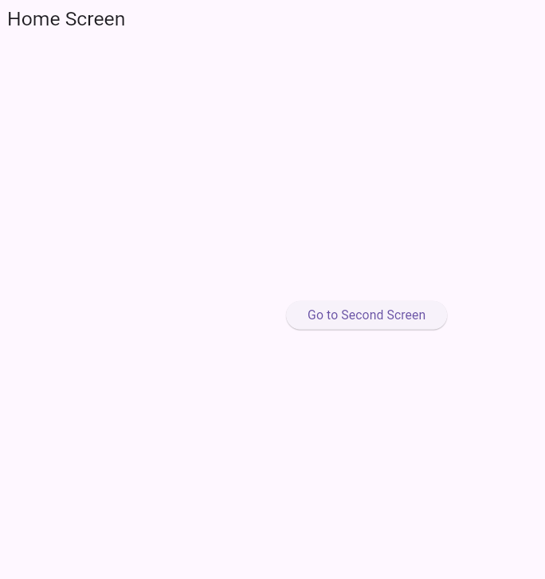

# Flutter Navigation Examples

This README contains two Flutter navigation programs:

## Program Output




## A) Push & Pop Navigation

This example demonstrates simple navigation using **Navigator.push()** and **Navigator.pop()**.

### Code

```dart
import 'package:flutter/material.dart';

void main() {
  runApp(MyApp());
}

class MyApp extends StatelessWidget {
  @override
  Widget build(BuildContext context) {
    return MaterialApp(
      debugShowCheckedModeBanner: false,
      home: HomeScreen(),
    );
  }
}

class HomeScreen extends StatelessWidget {
  @override
  Widget build(BuildContext context) {
    return Scaffold(
      appBar: AppBar(title: Text("Home Screen")),
      body: Center(
        child: ElevatedButton(
          child: Text("Go to Second Screen"),
          onPressed: () {
            Navigator.push(
              context,
              MaterialPageRoute(builder: (context) => SecondScreen()),
            );
          },
        ),
      ),
    );
  }
}

class SecondScreen extends StatelessWidget {
  @override
  Widget build(BuildContext context) {
    return Scaffold(
      appBar: AppBar(title: Text("Second Screen")),
      body: Center(
        child: ElevatedButton(
          child: Text("Go Back"),
          onPressed: () {
            Navigator.pop(context);
          },
        ),
      ),
    );
  }
}
```

---

## B) Named Routes Navigation

This example demonstrates navigation using predefined **named routes**.

### Code

```dart
import 'package:flutter/material.dart';

void main() {
  runApp(MyApp());
}

class MyApp extends StatelessWidget {
  @override
  Widget build(BuildContext context) {
    return MaterialApp(
      debugShowCheckedModeBanner: false,

      initialRoute: '/',
      routes: {
        '/': (context) => HomeScreen(),
        '/second': (context) => SecondScreen(),
      },
    );
  }
}

class HomeScreen extends StatelessWidget {
  @override
  Widget build(BuildContext context) {
    return Scaffold(
      appBar: AppBar(title: Text("Home Screen")),
      body: Center(
        child: ElevatedButton(
          child: Text("Go to Second Screen"),
          onPressed: () {
            Navigator.pushNamed(context, '/second');
          },
        ),
      ),
    );
  }
}

class SecondScreen extends StatelessWidget {
  @override
  Widget build(BuildContext context) {
    return Scaffold(
      appBar: AppBar(title: Text("Second Screen")),
      body: Center(
        child: ElevatedButton(
          child: Text("Go Back"),
          onPressed: () {
            Navigator.pop(context);
          },
        ),
      ),
    );
  }
}
```

---