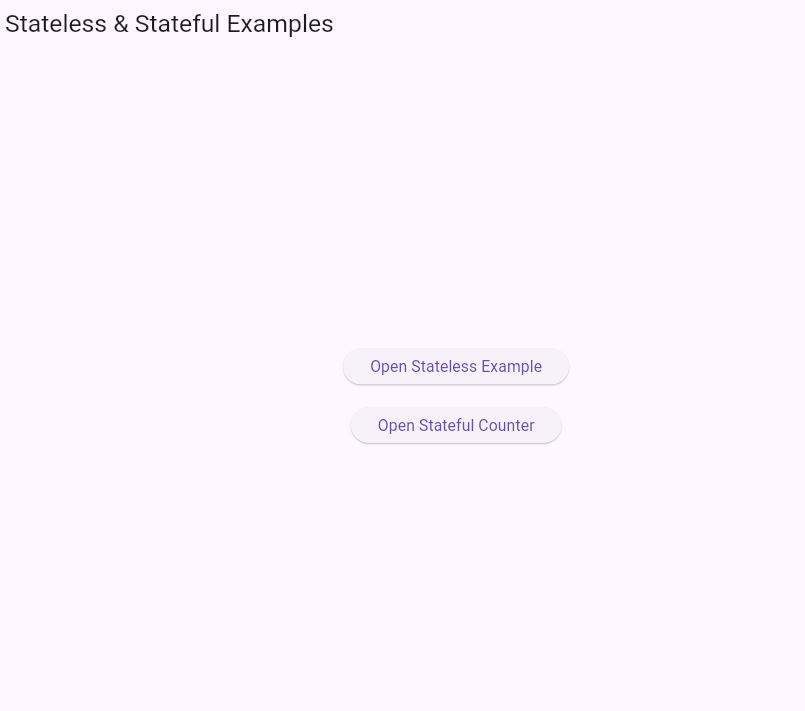

---

# 📘 README – Flutter Widgets

## A) Stateless Example

This program demonstrates a **StatelessWidget**, which does **not change** once built.
It displays static text on the screen.

### ✅ Description

* A stateless widget shows fixed content.
* It does not update when user interacts.
* Best for UI elements that remain constant.


## Program Output





### ✅ Code

```dart
import 'package:flutter/material.dart';

void main() {
  runApp(MyApp());
}

class MyApp extends StatelessWidget {
  @override
  Widget build(BuildContext context) {
    return MaterialApp(
      home: Scaffold(
        appBar: AppBar(title: Text('Stateless Example')),
        body: Center(
          child: Text(
            'Hello, this is a Stateless Widget!',
            style: TextStyle(fontSize: 20),
          ),
        ),
      ),
    );
  }
}
```

---

## B) Stateful Counter Example

This program demonstrates a **StatefulWidget**, which can **change state** when a user interacts.
Clicking the button increases the counter.

### ✅ Description

* A counter is displayed.
* Pressing the floating button updates the value.
* Uses `setState()` to rebuild the UI with new data.

### ✅ Code

```dart
import 'package:flutter/material.dart';

void main() {
  runApp(MyApp());
}

class MyApp extends StatelessWidget {
  @override
  Widget build(BuildContext context) {
    return MaterialApp(
      home: CounterExample(),
    );
  }
}

class CounterExample extends StatefulWidget {
  @override
  _CounterExampleState createState() => _CounterExampleState();
}

class _CounterExampleState extends State<CounterExample> {
  int counter = 0;

  @override
  Widget build(BuildContext context) {
    return Scaffold(
      appBar: AppBar(title: Text('Stateful Counter')),
      body: Center(
        child: Text(
          'Counter: $counter',
          style: TextStyle(fontSize: 24),
        ),
      ),
      floatingActionButton: FloatingActionButton(
        onPressed: () {
          setState(() {
            counter++;
          });
        },
        child: Icon(Icons.add),
      ),
    );
  }
}
```

---
