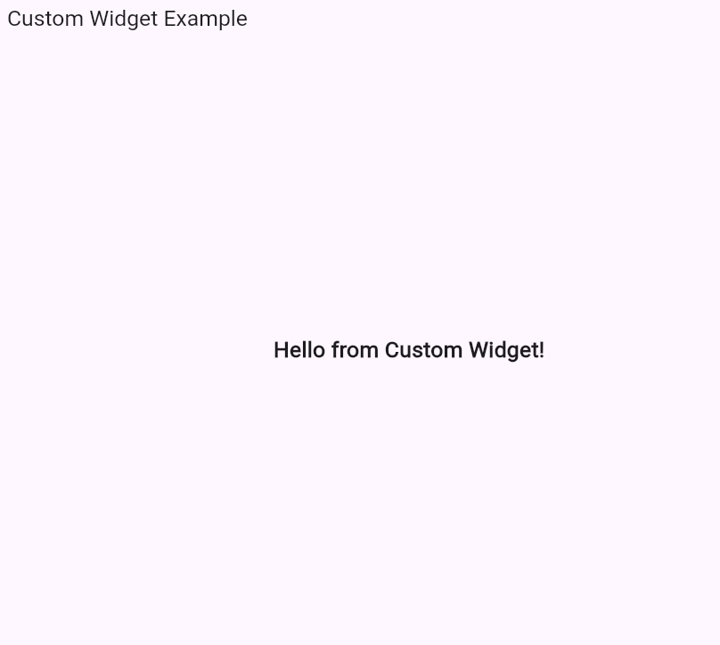

---

# Flutter Examples – Custom Widget & Simple Theme

This repository contains two basic Flutter examples:

1. **Custom Widget** – How to create and use a reusable custom widget.
2. **Simple Theme** – How to apply a global theme using `ThemeData`.

---

## Program Output




---

## **A) Custom Widget**

### **Description**

This example shows how to define your own widget (`MyCustomWidget`) and use it in the main UI. Custom widgets make your code clean, modular, and reusable.

### **Code (Minimum Example)**

```dart
import 'package:flutter/material.dart';

void main() {
  runApp(CustomWidgetApp());
}

class CustomWidgetApp extends StatelessWidget {
  @override
  Widget build(BuildContext context) {
    return MaterialApp(
      home: Scaffold(
        appBar: AppBar(title: Text('Custom Widget Example')),
        body: Center(
          child: MyCustomWidget(),
        ),
      ),
    );
  }
}

class MyCustomWidget extends StatelessWidget {
  @override
  Widget build(BuildContext context) {
    return Text(
      'Hello from Custom Widget!',
      style: TextStyle(fontSize: 22, fontWeight: FontWeight.bold),
    );
  }
}
```

---

## **B) Simple Theme**

### **Description**

This example demonstrates how to apply a global theme to the app using `ThemeData`. Themes control colors, fonts, and styles across your app for a consistent look.

### **Code (Minimum Example)**

```dart
import 'package:flutter/material.dart';

void main() {
  runApp(SimpleThemeApp());
}

class SimpleThemeApp extends StatelessWidget {
  @override
  Widget build(BuildContext context) {
    return MaterialApp(
      theme: ThemeData(
        primarySwatch: Colors.blue,
        textTheme: TextTheme(
          bodyLarge: TextStyle(fontSize: 22, color: Colors.blueAccent),
        ),
      ),
      home: Scaffold(
        appBar: AppBar(title: Text('Simple Theme Example')),
        body: Center(
          child: Text('Themed Text Example'),
        ),
      ),
    );
  }
}
```

---

## **▶ How to Run Both Examples in VS Code**

1. Install **Flutter** and **Dart** extensions.
2. Create a new Flutter project for each example:

   ```
   flutter create custom_widget_example
   flutter create simple_theme_example
   ```
3. Replace `lib/main.dart` with the respective code.
4. Run the project in VS Code:

   ```
   flutter run
   ```

---
