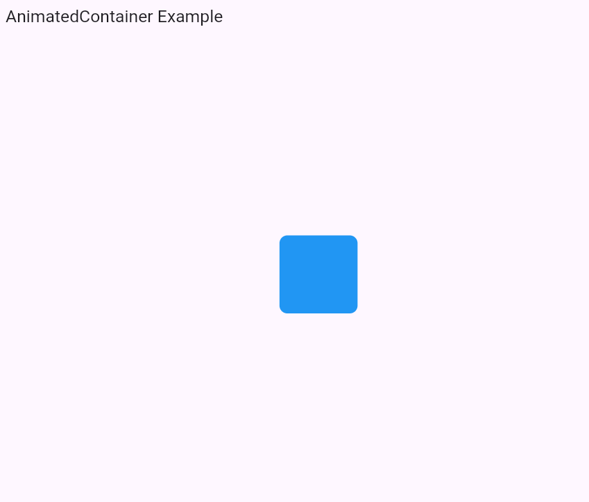

---

# 📌 Flutter Animations – Implicit & Explicit

This document explains two types of animations in Flutter:

1. **Implicit Animation** using `AnimatedContainer`
2. **Explicit Animation** using `FadeTransition` + `AnimationController`

Both examples are simple and ready to run in **VS Code**.

---

## Program Output




---

# 🅰️ Implicit Animation – AnimatedContainer

This example demonstrates an implicit animation where Flutter automatically animates changes in size, color, and border radius.

### ⭐ Features

* No AnimationController needed
* Smooth resizing
* Automatic animation on state change

### 📌 Code

```dart
import 'package:flutter/material.dart';

void main() {
  runApp(MyApp());
}

class MyApp extends StatefulWidget {
  @override
  _MyAppState createState() => _MyAppState();
}

class _MyAppState extends State<MyApp> {
  double _width = 100;
  double _height = 100;
  Color _color = Colors.blue;
  double _borderRadius = 10;

  void _changeShape() {
    setState(() {
      _width = _width == 100 ? 200 : 100;
      _height = _height == 100 ? 200 : 100;
      _color = _color == Colors.blue ? Colors.red : Colors.blue;
      _borderRadius = _borderRadius == 10 ? 50 : 10;
    });
  }

  @override
  Widget build(BuildContext context) {
    return MaterialApp(
      home: Scaffold(
        appBar: AppBar(title: Text("AnimatedContainer Example")),
        body: Center(
          child: GestureDetector(
            onTap: _changeShape,
            child: AnimatedContainer(
              duration: Duration(seconds: 1),
              curve: Curves.easeInOut,
              width: _width,
              height: _height,
              decoration: BoxDecoration(
                color: _color,
                borderRadius: BorderRadius.circular(_borderRadius),
              ),
            ),
          ),
        ),
      ),
    );
  }
}
```

---

# 🅱️ Explicit Animation – FadeTransition

This example shows an explicit animation where you manually control the animation using an `AnimationController`.

### ⭐ Features

* Full control over animation timing
* Uses `AnimationController`
* Applies opacity animation with `FadeTransition`

### 📌 Code

```dart
import 'package:flutter/material.dart';

void main() {
  runApp(MyApp());
}

class MyApp extends StatefulWidget {
  @override
  _MyAppState createState() => _MyAppState();
}

class _MyAppState extends State<MyApp> with SingleTickerProviderStateMixin {
  late AnimationController _controller;
  late Animation<double> _animation;

  @override
  void initState() {
    super.initState();

    _controller = AnimationController(
      vsync: this,
      duration: Duration(seconds: 2),
    );

    _animation = Tween<double>(begin: 0.0, end: 1.0).animate(_controller);

    _controller.repeat(reverse: true); // Fade in & fade out
  }

  @override
  void dispose() {
    _controller.dispose(); // Prevent memory leak
    super.dispose();
  }

  @override
  Widget build(BuildContext context) {
    return MaterialApp(
      home: Scaffold(
        appBar: AppBar(title: Text("FadeTransition Example")),
        body: Center(
          child: FadeTransition(
            opacity: _animation,
            child: Text(
              'Hello Flutter!',
              style: TextStyle(fontSize: 28),
            ),
          ),
        ),
      ),
    );
  }
}
```

---

# ▶️ How to Run in VS Code

1. Create a Flutter project
2. Replace `main.dart` with any of the above examples
3. Press **F5** to run

---