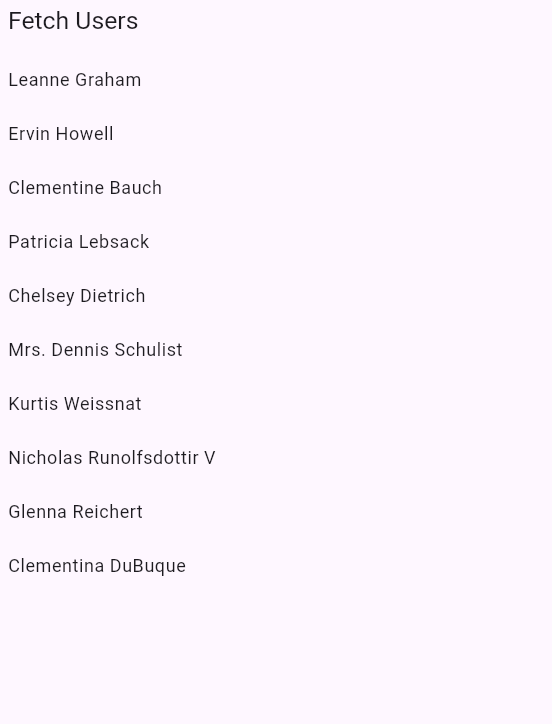
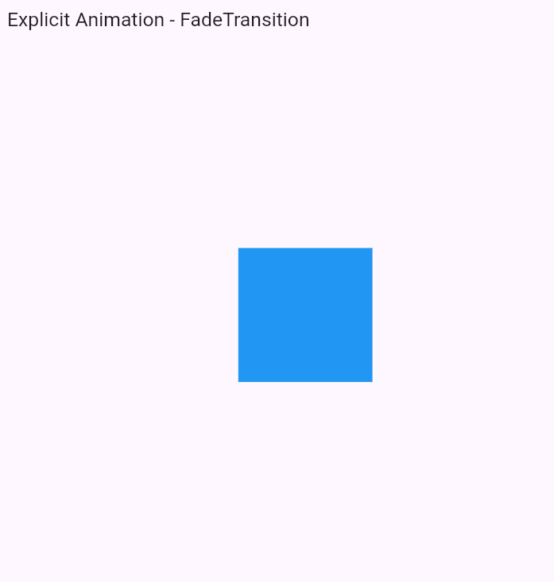

---

# 📘 **README.md – Implicit & Explicit Animations in Flutter**

```md
# Flutter Animations – Implicit & Explicit

This project contains two animation examples:

- **a) Implicit Animation (AnimatedContainer)**
- **b) Explicit Animation (FadeTransition + AnimationController)**

Both examples are designed to help you understand the difference between **implicit** and **explicit** animations in Flutter.
---

## Program Output




---

## 🚀 a) Implicit Animation – AnimatedContainer

### 📌 Overview
This example uses **AnimatedContainer**, an implicit animation widget that automatically animates changes in its properties such as size, color, and margin.  
Flutter handles the animation for you – no controller required.

### 🛠 Features
- Smooth animation when properties change
- Easy to implement
- No AnimationController needed

### ▶ How it Works
When the user taps the box, its size changes and Flutter automatically animates the transition.

---

## 🚀 b) Explicit Animation – FadeTransition

### 📌 Overview
This example uses **AnimationController**, **Tween**, and **FadeTransition** to animate the opacity of a widget.  
Explicit animation gives you full control over timing, direction, and behavior.

### 🛠 Features
- Uses AnimationController
- Full control of animation speed & curve
- Controls opacity using Tween<double>

### ▶ How it Works
The box fades in from 0 to 1 opacity when the screen loads.

---

## 🔧 How to Run (VS Code)

1. Install Flutter & Dart  
2. Create a new Flutter project:
```

flutter create animation_examples

```
3. Replace the `lib/main.dart` file with the code for example **a** or **b**.  
4. Run the app:
```

flutter run

```

---

## 📂 Difference Between Implicit & Explicit Animations

| Feature | Implicit Animation | Explicit Animation |
|--------|--------------------|--------------------|
| Controller | ❌ Not required | ✅ Required |
| Complexity | Easy | More control, harder |
| Customization | Limited | Highly customizable |
| Example Widget | AnimatedContainer | FadeTransition |

---

## ✔ Summary
- Use **Implicit Animations** when you want simple transitions.  
- Use **Explicit Animations** when you need full control.

```

---